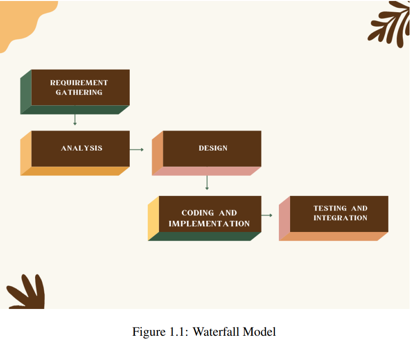
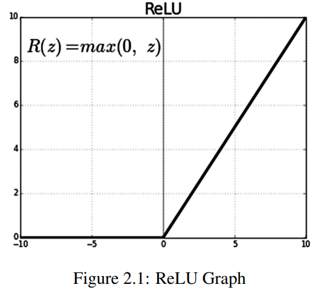
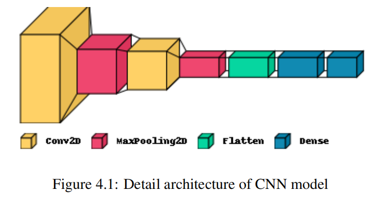

# CIFAR-10 Dataset: Image Classification/Object Detection

This repository demonstrates real-time object detection/image classification using a Convolutional Neural Network (CNN) applied to the CIFAR-10 dataset. The project achieves high accuracy and efficient processing times, focusing on deep learning techniques and optimization strategies.

---

**Contents**  
1. **Introduction**  
   1.1 Introduction  
   1.2 Problem Statement  
   1.3 Project Objectives  
   1.4 Scope and Limitations  
       1.4.1 Development Methodology  

2. **Background Study**  
   2.1 Background  
       2.1.1 Deep Learning  
       2.1.2 Convolution Neural Network (CNN)  
       2.1.3 Activation Functions  

4. **System Design**  
   4.1 CNN Configuration  
   4.2 System Workflow  
   4.3 Modular Decomposition  
   4.4 Component-Level Design  
       4.4.1 Algorithm Details  

5. **Implementation and Testing**  
   5.1 Implementation  
       5.1.1 Implementation Tools  
       5.1.2 Implementation Details  
   5.2 Testing  
       5.2.1 Unit Testing  
       5.2.2 System Testing  
   5.3 Limitations  
   5.4 Result Analysis  

6. **Future Recommendations and Conclusion**  
   6.1 Future Recommendations  
   6.2 Conclusion  

7. **References**

---

**List of Figures**  
1.1 Waterfall Model  
2.1 ReLU Graph  
3.1 Use Case Diagram  
3.2 Gantt Chart of Scheduled Feasibility  
3.3 CIFAR-10 Dataset Examples  
3.4 Activity Diagram  
4.1 Detailed Architecture of CNN Model  
4.2 Types of Pooling Layers  
4.3 Fully Connected Layer  
4.4 Block Diagram of Object Detection System  
4.5 Sequence Diagram  
5.1 Home Page for Choosing Files  
5.2 File Upload Page  
5.3 Prediction Results  
5.4 Training Accuracy and Loss (1×1 Kernel)  
5.5 Training Accuracy and Loss (3×3 Kernel)  
5.6 Training Accuracy and Loss (5×5 Kernel)  
5.7 Confusion Matrix  
6.1 Homepage Layout  
6.2 Image Upload Page  

---

**List of Tables**  
4.1 CNN Details  
5.1 Test Cases for Uploading Images  
5.2 Test Cases for Image Detection  
5.3 Result Analysis for Kernels  

---
# Chapter 1 Introduction
1.1 Introduction

In the recent years, there has been an exponential progress in the field of machine learning and
artificial intelligence which has led to improvement in accuracy, reduction in human efforts
and failure rate. This development has played a commendable role in reducing processing
time, which has further led to improvement in net productivity and corresponding reduction in
the cost.
Object Detection(OD) is a challenging and exciting task in computer vision.It can be difficult
since there are all kinds of variations in orientation, lighting, background and occlusion that
can result in completely different images of the very same object.
The widely used object detection applications are human–computer interaction, video surveillance, satellite imagery, transport system, and activity recognition. In the wider family of deep
learning architectures, convolutional neural network (CNN) made up with set of neural network layers is used for visual imagery. Deep CNN architectures exhibit impressive results for
detection of objects in digital image.
The project comes with the technique of "Object Classification Using Light Weight CNN"
which includes various research sides of computer science. The project is to take a picture of
an object and process it up to recognize the image of that object like a human brain recognize
the various objects[1]. The project contains the deep idea of the Image Processing techniques
and the big research area of machine learning(ML) and the building block of the machine
learning called Neural Network .

# 1.2 Problem Statement

Object detection is a bit more complex task. We donot have proper algorithm to create the
automated system and real time object detection. So through this project different real time
objects can be easily detected even in the low resolution and develop a machine learning model
that can predict the object present in an image in real-time using a lightweight convolutional
neural network (CNN) architecture. Using CNN, it resolves problems like overfitting and also
reduces time complexity. It can have input as images in proper grayscale size and then the
images are fragmented in smaller sizes for better clearity and understanding of machine.

# 1.3 Project Objectives

The main objective of this project is to design and implement a CNN that can accurately predict
objects in real-time using the CIFAR10 dataset . The specific goals of the project are:
1. To train the model on the CIFAR10 dataset and evaluate its performance in terms of
accuracy and speed.
2. To optimize the model to reduce the response time and improve the prediction accuracy,
making it suitable for various real-world applications.

# 1.4 Scope and Limitations
The scope of the "Object Classification Using Light Weight CNN" project encompasses the
following areas:
1. The project aims to develop a CNN model that can accurately predict objects in real-time
with a fast response time.
2. The model performance will be evaluated in terms of accuracy and response time, and
further optimized to improve its performance.
The "Object Classification Using Light Weight CNN" project may face the following limitations:
1. More than 10 objects cannot be detected.
2. The model may not perform well on real-world objects and scenes that are significantly
different from those in the CIFAR10 dataset, leading to lower accuracy and prediction
errors.
3. The model may not generalize well to other datasets and real-world scenarios, requiring
further fine-tuning or transfer learning techniques to adapt to new environments.
# 1.4.1 Development Methodology
The model chosen for this system is “WaterFall model”. This is a simple project with the
well-defined process and the requirement. The various steps of the waterfall model is followed
throughout the whole project. This model is understood and incorporate in this project.Very
less user is involved during the development of these projects. Thus, this system is developed

according to the Waterfall model. The various Steps of the Waterfall is shown in figure 1.1
The "Object Classification Using Light Weight CNN" project can be developed using the waterfall model, which is a sequential and linear approach to software development. The following are the main phases of the waterfall model that can be applied to this project:
1. Requirements gathering:
In this phase, the requirements and specifications for the project are gathered and documented.We identify the specific datasets required for this project, including the CIFAR10 dataset required to train and test the CNN model.The training dataset consists of
50,000 32X32 colour images of 10 different objects. These are the different classes of
images in the dataset which consist of aeroplane, automobile, bird, cat, deer, dog, frog,
horse, ship and truck.
2. Analysis and design:
In this phase, the requirements are analyzed and a detailed design of the model and user
interface is developed.We trained the CNN model on the Cifar10 dataset using a machine
learning development tool called Google Colaboratory and define the user interface .
3. Coding and Implementation:
In coding phase, system backend is developed by using python. After this the model and
3
user interface are implemented and developed. We trained the model on the CIFAR10
dataset, built the user interface and integrate the model with the user interface.
4. Testing:
In this phase, the model and user interface are tested and validated to ensure they meet
the specifications and requirements. With CNN, at the end 100 epochs, accuracy was at
around 98 percent with an average processing time of 48ms/step.
Chapter 2 Background Study and Literature Review
2.1 Background
2.1.1 Deep learning
Deep learning, a subset of machine learning which in turn is a subset of artificial intelligence
(AI) has networks capable of learning things from the data that is unstructured or unlabeled.
The approach utilized in this project is Convolutional Neural Networks (CNN). Deep learning
is a popular technique used in computer vision[2]. We chose Convolutional Neural Network
(CNN) layers as building blocks to create our model architecture. CNNs are known to imitate
how the human brain works when analyzing visuals [3]. A typical architecture of a convolutional neural network contains an input layer, some convolutional layers, some dense layers
(aka. fully-connected layers), and an output layer. These are linearly stacked layers ordered in
sequence.
# 2.1.2 Convolution Neural Network(CNN)
CNN is a deep learning algorithm that take an input image, assign learnable biases and weights
to numerous objects in the image and differentiate one from the other. As comparing to other
classification algorithm, the preprocessing needed in CNN is much lower and are used in object
detection, plant disease detection, fraud identification and many more.It is like the connectivity
of neurons pattern in human brain and motivated by the visual cortex organization. A CNN
model works in three stages. In the first stage, a convolutional layer extracts the features of
the image/data. In the second stage a pooling layer reduces the dimensionality of the image,
so small changes do not create a big change on the model. Simply saying, it prevents over
fitting. In the third stage a flattening layer transforms our model in one-dimension and feeds
it to the fully connected dense layer. This dense layer then performs prediction of image. A
good model has multiple layers of convolutional layers and pooling layers.
2.1.3 Activation functions
Activation functions are used in the layers of the Convolutional Neural Network (CNN) model
to introduce non-linearity into the model. This non-linearity allows the model to learn complex
representations of the input data, which is important for accurate object recognition and prediction.There are several activation functions that can be used in the layers of a CNN model.ReLU
5
is used in our project as an activation function.
1. ReLU (Rectified Linear Unit)
ReLU is a popular activation function that replaces negative values with zero and leaves
positive values unchanged [4]. This activation function is computationally efficient and
has been shown to improve the convergence of the model.ReLU is an important component in the "Object Classification Using CNN". It helps to improve the accuracy of
predictions, speed up computation time, and provide a non-linear decision boundary for
the model to learn from.

# 3.2 Dataset Description
The CIFAR-10 dataset (Canadian Institute for Advanced Research) is a collection of images
that are commonly used to train machine learning and computer vision algorithms.
In this project, a CNN model is trained on the CIFAR10 dataset, which is a widely used dataset
for object recognition and image classification tasks. The CIFAR10 dataset contains 60,000
32x32 color training images and 10,000 test images, covering 10 classes of objects, such as
airplanes, cars, birds, and cats[8].
The training process involves using the input data (the images from the CIFAR10 dataset)[9]
to adjust the weights and biases of the model so that it can accurately recognize and predict
the class of an object in an image.
Once the model is trained, it can be used for real-time object recognition by processing an
input image and making a prediction based on the learned representations. The user interface
is used to allow users to input images and receive the predictions made by the model.
Here are the classes in the dataset , as well as 10 random images from each shown in 3.3:
The classes are completely mutually exclusive. There is no overlap between automobiles and
trucks. "Automobile" includes sedans, SUVs, things of that sort. "Truck" includes only big
trucks. Neither includes pickup trucks.

# Chapter 4 System Design

4.1 CNN Configuration

In simpler words, CNN is an artificial neural network that specializes in picking out or detect
patterns and make sense of them. Thus, CNN has been most useful for image classification.
A CNN model has various types of filters of different sizes and numbers. These filters are
essentially what helps us in detecting the pattern.
The convolutional neural network, or CNN for short, is a specialized type of neural network
model designed for working with two-dimensional image data, although they can be used with
one-dimensional and three-dimensional data. Central to the convolutional neural network is
the convolutional layer that gives the network its name. This layer performs an operation
called a “convolution”. A CNN model generally consists of convolutional and pooling layers.
It works better for data that are represented as grid structures, this is the reason why CNN
works well for image classification problems.
The dropout layer is used to deactivate some of the neurons and while training, it reduces over
fitting of the model. Our model is composed of feature extraction with convolution and binary
classification. Convolution and max pooling are carried out to extract the features in the image,
and a 32 3x3 convolution filters are applied to a 28x28 image followed by a max-pooling layer
of 2x2 pooling size followed by another convolution layer with 64 3x3 filters. A detailed visual
explanation is shown in Figure 4.1. The typical structure of a CNN consists of three basic

