# CIFAR-10 Dataset: Image Classification/Object Detection

This repository demonstrates real-time object detection/image classification using a Convolutional Neural Network (CNN) applied to the CIFAR-10 dataset. The project achieves high accuracy and efficient processing times, focusing on deep learning techniques and optimization strategies.

---

**Contents**  
1. **Introduction**  
   1.1 Introduction  
   1.2 Problem Statement  
   1.3 Project Objectives  
   1.4 Scope and Limitations  
       1.4.1 Development Methodology  

2. **Background Study**  
   2.1 Background  
       2.1.1 Deep Learning  
       2.1.2 Convolution Neural Network (CNN)  
       2.1.3 Activation Functions
       2.1.4 Dataset Description 

3. **System Design**  
   3.1 CNN Configuration  
   3.2 System Workflow  
   3.3 Algorithm Details  

4. **Implementation and Testing**  
   4.1 Implementation  
       4.1.1 Implementation Tools  
       4.1.2 Implementation Details  
   4.2 Testing  
       4.2.1 Unit Testing  
       4.2.2 System Testing  
   4.3 Limitations  
   4.4 Result Analysis  

5. **Future Recommendations and Conclusion**  
   5.1 Future Recommendations  
   5.2 Conclusion
   5.3 Snapshot(Object Detection)

---

**List of Figures**  
1.1 Waterfall Model  
2.1 ReLU Graph   
3.3 CIFAR-10 Dataset Examples  
3.4 Activity Diagram  
4.1 Detailed Architecture of CNN Model  
4.2 Types of Pooling Layers  
4.3 Fully Connected Layer  
4.4 Block Diagram of Object Detection System  
5.1 Home Page for Choosing Files  
5.2 File Upload Page  
5.3 Prediction Results  
5.4 Training Accuracy and Loss (1×1 Kernel)  
5.5 Training Accuracy and Loss (3×3 Kernel)  
5.6 Training Accuracy and Loss (5×5 Kernel)  
6.1 Homepage Layout  
6.2 Image Upload Page  

---

**List of Tables**  
4.1 CNN Details  
5.1 Test Cases for Uploading Images  
5.2 Test Cases for Image Detection  
5.3 Result Analysis for Kernels  

---
# Chapter 1 Introduction
# 1.1 Introduction

In the recent years, there has been an exponential progress in the field of machine learning and
artificial intelligence which has led to improvement in accuracy, reduction in human efforts
and failure rate. This development has played a commendable role in reducing processing
time, which has further led to improvement in net productivity and corresponding reduction in
the cost.
Object Detection(OD) is a challenging and exciting task in computer vision.It can be difficult
since there are all kinds of variations in orientation, lighting, background and occlusion that
can result in completely different images of the very same object.
The widely used object detection applications are human–computer interaction, video surveillance, satellite imagery, transport system, and activity recognition. In the wider family of deep
learning architectures, convolutional neural network (CNN) made up with set of neural network layers is used for visual imagery. Deep CNN architectures exhibit impressive results for
detection of objects in digital image.
The project comes with the technique of "Object Classification Using Light Weight CNN"
which includes various research sides of computer science. The project is to take a picture of
an object and process it up to recognize the image of that object like a human brain recognize
the various objects[1]. The project contains the deep idea of the Image Processing techniques
and the big research area of machine learning(ML) and the building block of the machine
learning called Neural Network .

# 1.2 Problem Statement

Object detection is a bit more complex task. We donot have proper algorithm to create the
automated system and real time object detection. So through this project different real time
objects can be easily detected even in the low resolution and develop a machine learning model
that can predict the object present in an image in real-time using a lightweight convolutional
neural network (CNN) architecture. Using CNN, it resolves problems like overfitting and also
reduces time complexity. It can have input as images in proper grayscale size and then the
images are fragmented in smaller sizes for better clearity and understanding of machine.

# 1.3 Project Objectives

The main objective of this project is to design and implement a CNN that can accurately predict
objects in real-time using the CIFAR10 dataset . The specific goals of the project are:
1. To train the model on the CIFAR10 dataset and evaluate its performance in terms of
accuracy and speed.
2. To optimize the model to reduce the response time and improve the prediction accuracy,
making it suitable for various real-world applications.

# 1.4 Scope and Limitations
The scope of the "Object Classification Using Light Weight CNN" project encompasses the
following areas:
1. The project aims to develop a CNN model that can accurately predict objects in real-time
with a fast response time.
2. The model performance will be evaluated in terms of accuracy and response time, and
further optimized to improve its performance.
The "Object Classification Using Light Weight CNN" project may face the following limitations:
1. More than 10 objects cannot be detected.
2. The model may not perform well on real-world objects and scenes that are significantly
different from those in the CIFAR10 dataset, leading to lower accuracy and prediction
errors.
3. The model may not generalize well to other datasets and real-world scenarios, requiring
further fine-tuning or transfer learning techniques to adapt to new environments.

# 1.4.1 Development Methodology
The model chosen for this system is “WaterFall model”. This is a simple project with the
well-defined process and the requirement. The various steps of the waterfall model is followed
throughout the whole project. This model is understood and incorporate in this project.Very
less user is involved during the development of these projects. Thus, this system is developed
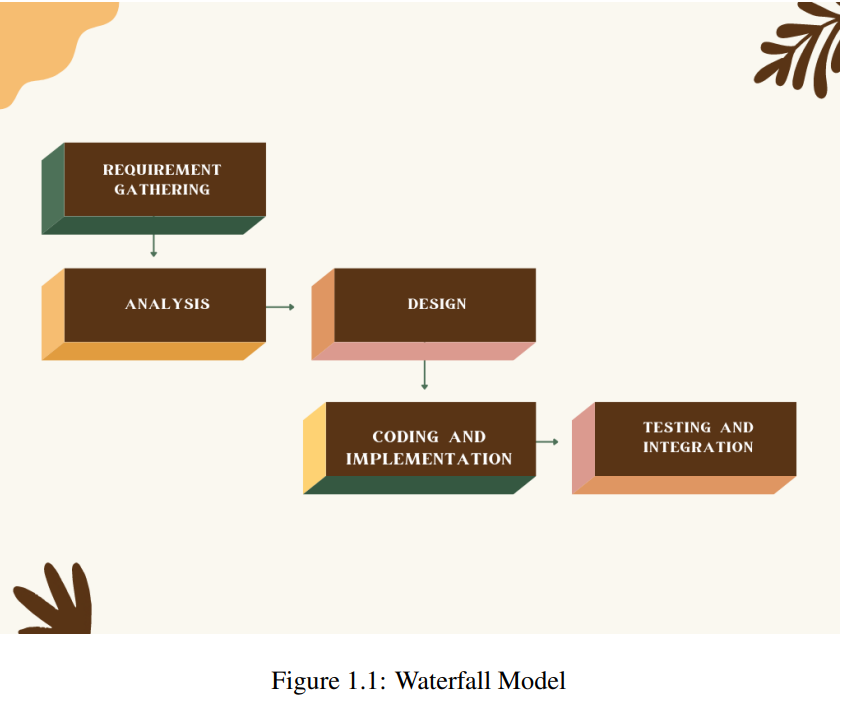
according to the Waterfall model. The various Steps of the Waterfall is shown in figure 1.1
The "Object Classification Using Light Weight CNN" project can be developed using the waterfall model, which is a sequential and linear approach to software development. The following are the main phases of the waterfall model that can be applied to this project:
1. Requirements gathering:
In this phase, the requirements and specifications for the project are gathered and documented.We identify the specific datasets required for this project, including the CIFAR10 dataset required to train and test the CNN model.The training dataset consists of
50,000 32X32 colour images of 10 different objects. These are the different classes of
images in the dataset which consist of aeroplane, automobile, bird, cat, deer, dog, frog,
horse, ship and truck.
2. Analysis and design:
In this phase, the requirements are analyzed and a detailed design of the model and user
interface is developed.We trained the CNN model on the Cifar10 dataset using a machine
learning development tool called Google Colaboratory and define the user interface .
3. Coding and Implementation:
In coding phase, system backend is developed by using python. After this the model and
3
user interface are implemented and developed. We trained the model on the CIFAR10
dataset, built the user interface and integrate the model with the user interface.
4. Testing:
In this phase, the model and user interface are tested and validated to ensure they meet
the specifications and requirements. With CNN, at the end 100 epochs, accuracy was at
around 98 percent with an average processing time of 48ms/step.
# Chapter 2 Background Study 
# 2.1 Background
# 2.1.1 Deep learning
Deep learning, a subset of machine learning which in turn is a subset of artificial intelligence
(AI) has networks capable of learning things from the data that is unstructured or unlabeled.
The approach utilized in this project is Convolutional Neural Networks (CNN). Deep learning
is a popular technique used in computer vision[2]. We chose Convolutional Neural Network
(CNN) layers as building blocks to create our model architecture. CNNs are known to imitate
how the human brain works when analyzing visuals [3]. A typical architecture of a convolutional neural network contains an input layer, some convolutional layers, some dense layers
(aka. fully-connected layers), and an output layer. These are linearly stacked layers ordered in
sequence.
# 2.1.2 Convolution Neural Network(CNN)
CNN is a deep learning algorithm that take an input image, assign learnable biases and weights
to numerous objects in the image and differentiate one from the other. As comparing to other
classification algorithm, the preprocessing needed in CNN is much lower and are used in object
detection, plant disease detection, fraud identification and many more.It is like the connectivity
of neurons pattern in human brain and motivated by the visual cortex organization. A CNN
model works in three stages. In the first stage, a convolutional layer extracts the features of
the image/data. In the second stage a pooling layer reduces the dimensionality of the image,
so small changes do not create a big change on the model. Simply saying, it prevents over
fitting. In the third stage a flattening layer transforms our model in one-dimension and feeds
it to the fully connected dense layer. This dense layer then performs prediction of image. A
good model has multiple layers of convolutional layers and pooling layers.
# 2.1.3 Activation functions
Activation functions are used in the layers of the Convolutional Neural Network (CNN) model
to introduce non-linearity into the model. This non-linearity allows the model to learn complex
representations of the input data, which is important for accurate object recognition and prediction.There are several activation functions that can be used in the layers of a CNN model.ReLU is used in our project as an activation function.
1. ReLU (Rectified Linear Unit)
ReLU is a popular activation function that replaces negative values with zero and leaves
positive values unchanged [4]. This activation function is computationally efficient and
has been shown to improve the convergence of the model.ReLU is an important component in the "Object Classification Using CNN". It helps to improve the accuracy of
predictions, speed up computation time, and provide a non-linear decision boundary for
the model to learn from.
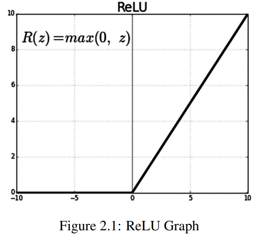

# 2.1.4 Dataset Description
The CIFAR-10 dataset (Canadian Institute for Advanced Research) is a collection of images
that are commonly used to train machine learning and computer vision algorithms.
In this project, a CNN model is trained on the CIFAR10 dataset, which is a widely used dataset
for object recognition and image classification tasks. The CIFAR10 dataset contains 60,000
32x32 color training images and 10,000 test images, covering 10 classes of objects, such as
airplanes, cars, birds, and cats.
The training process involves using the input data (the images from the CIFAR10 dataset)
to adjust the weights and biases of the model so that it can accurately recognize and predict
the class of an object in an image.
Once the model is trained, it can be used for real-time object recognition by processing an
input image and making a prediction based on the learned representations. The user interface
is used to allow users to input images and receive the predictions made by the model.
Here are the classes in the dataset , as well as 10 random images from each shown in 3.3:
The classes are completely mutually exclusive. There is no overlap between automobiles and
trucks. "Automobile" includes sedans, SUVs, things of that sort. "Truck" includes only big
trucks. Neither includes pickup trucks.

# Chapter 3 System Design

# 3.1 CNN Configuration

In simpler words, CNN is an artificial neural network that specializes in picking out or detect
patterns and make sense of them. Thus, CNN has been most useful for image classification.
A CNN model has various types of filters of different sizes and numbers. These filters are
essentially what helps us in detecting the pattern.
The convolutional neural network, or CNN for short, is a specialized type of neural network
model designed for working with two-dimensional image data, although they can be used with
one-dimensional and three-dimensional data. Central to the convolutional neural network is
the convolutional layer that gives the network its name. This layer performs an operation
called a “convolution”. A CNN model generally consists of convolutional and pooling layers.
It works better for data that are represented as grid structures, this is the reason why CNN
works well for image classification problems.
The dropout layer is used to deactivate some of the neurons and while training, it reduces over
fitting of the model. Our model is composed of feature extraction with convolution and binary
classification. Convolution and max pooling are carried out to extract the features in the image,
and a 32 3x3 convolution filters are applied to a 28x28 image followed by a max-pooling layer
of 2x2 pooling size followed by another convolution layer with 64 3x3 filters. A detailed visual
explanation is shown in Figure 4.1. The typical structure of a CNN consists of three basic layers
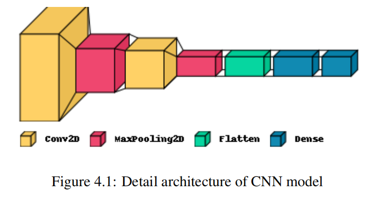
# 1. Convolutional Layer:
Convolutional layers are the major building blocks used in convolutional neural net￾works. A convolution is the simple application of a filter to an input that results in anactivation. We have used sequential model and used 2D convolution with 3,3 kernel
with 32 filters. MaxPooling method is used for downsizing the dimensions with relu
activation function.We have used output layer with ‘softmax’ activation function.Model
is again compiled with optimizer ‘adam’.The result is highly specific features that can
be detected anywhere on input images.We tested our model with different kernel sizes,
including 1x1, 3x3, and 5x5. We found that the model achieved the best accuracy with
a 3x3 kernel size.
The numerical results of the network on the CIFAR-10 dataset are reported. We achieved
an accuracy of 98 percent on the test set, which is a good performance for this dataset.
# 2. Pooling Layer:
Pooling layers are one of the building blocks of Convolutional Neural Networks. Where
Convolutional layers extract features from images.
In this project we used a max-pooling layer with a size of 2x2 and a stride of 2 after
the first convolutional layer. This layer reduces the spatial size of the feature maps by a
factor of 2 in both dimensions.
To reduce the dimensions of the hidden layer by combining the outputs of neuron clusters at the previous layer into a single neuron in the next layer.
There are two types of pooling that are used:
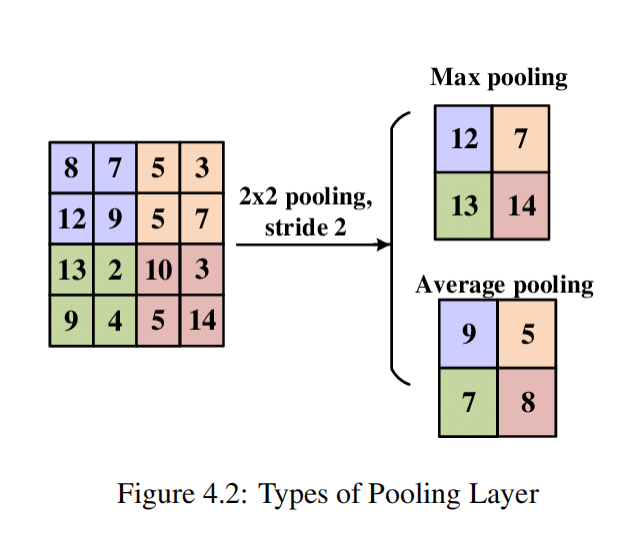
(a) Max pooling:
This works by selecting the maximum value from every pool. Max Pooling retains
the most prominent features of the feature map, and the returned image is sharper
than the original image.
(b) Average pooling: This pooling layer works by getting the average of the pool. Average pooling retains the average values of features of the feature map. It smooths
the image while keeping the essence of the feature in an image.
# 3. Fully Connected Layer
A fully connected layer refers to a neural network in which each neuron applies a linear
transformation to the input vector through a weights matrix. As a result, all possible
connections layer-to-layer are present, meaning every input of the input vector influences
every output of the output vector.
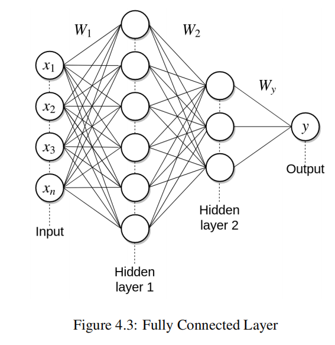

Summary of the model is shown in the table 
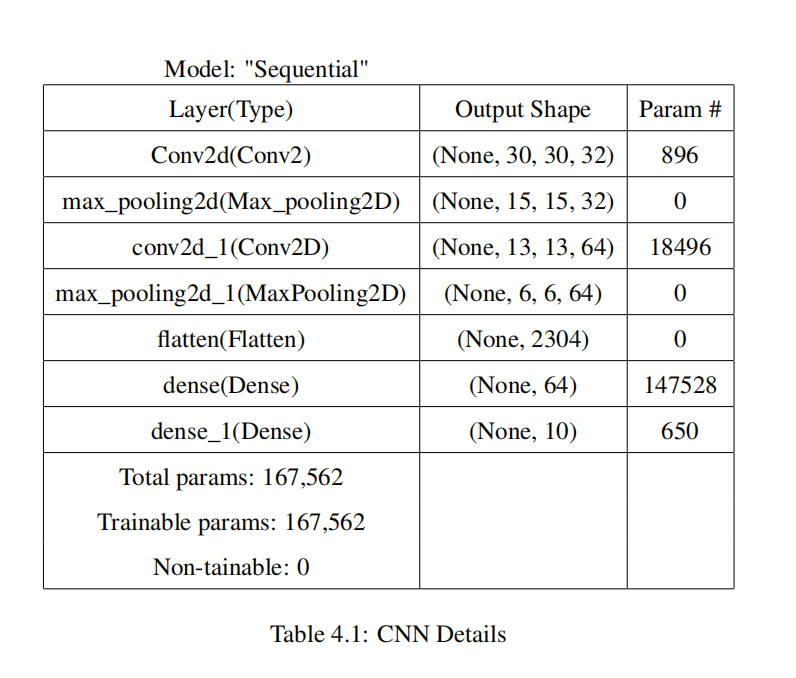
# 3.2 System Workflow
Figure 4.4 shows the block diagram for "Object Classification Using light weight CNN
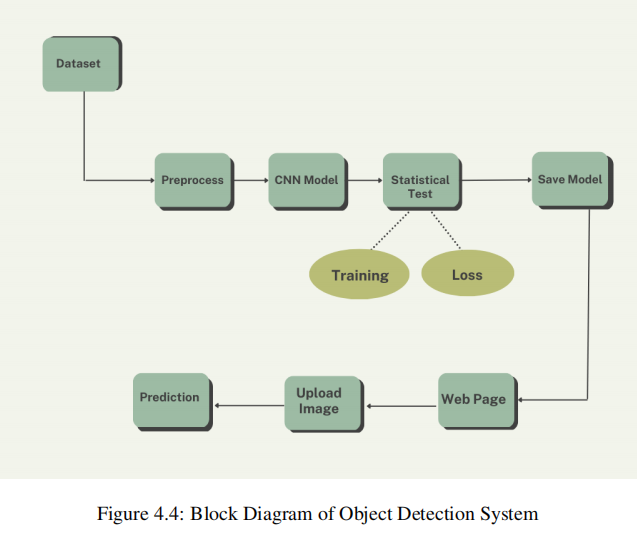

# 3.3 Algorithm Details
In the project the CNN architecture consists of two convolutional layers, each followed by a
max pooling layer, and two dense layers at the end. The input data has shape (32,32,3), where
32x32 represents the size of the image and 3 represents the number of color channels (RGB).
Mathematically, the convolution operation can be expressed as:
Z[i, j] = (W ∗ X)[i, j] + b

Where Z is the output feature map, W is the filter matrix, X is the input image, b is a bias
term, and * denotes the convolution operation. The filter matrix W is learned during training
using backpropagation, and the bias term b is a scalar value that is added to each element of
the output feature map.
The activation function used in this layer is ’relu’ (Rectified Linear Unit), which introduces
non-linearity to the model. The relu activation function is defined as

f(x) = max(0, x) 

which means that if the input to the activation function is negative, it will output 0, and if it is
positive, it will output the same value.
The ’relu’ activation function is used after this convolutional layer. Another max pooling layer
with a pool size of (2,2) is then applied, resulting in an output with dimensions (6,6,64).
After the second pooling layer, a flatten layer is applied to convert the 3D output into a 1D
vector. This 1D vector is then passed through two dense layers. The first dense layer has 64
neurons with ’relu’ activation, and the second dense layer has 10 neurons with ’softmax’ activation. The softmax function is used to produce a probability distribution over the 10 possible
classes in the CIFAR-10 dataset.
The CNN is compiled using the ’adam’ optimizer, loss function, and ’accuracy’ metric. During training, the model is trained for 100 epochs, and the training data is divided into batches
of 32 samples each.
During the training process, the CNN learns to adjust the values of the weights in each layer
so as to minimize the loss function. The optimization algorithm (in this case, Adam) uses
backpropagation to calculate the gradients of the loss function with respect to the weights, and
updates the weights accordingly.
With CNN, at the end 100 epochs, accuracy was at around 98 percentage with an average processing time of 48ms/step. CNN’s are best for image classification and gives superb accuracy.
Also computation is much less compared to simple ANN as maxpooling reduces the image
dimensions while still preserving the features.

# Chapter 4 Implementation and Testing
# 4.1 Implementation
The system implementation of the project "Object Classification Using Light Weight CNN"
involves several components.
First, the lightweight CNN model is trained on the Cifar10 dataset using a machine learning
development tool called Google Colaboratory. Once the model is trained, it can be exported
and integrated into the system.
Next, a real-time object detection component is implemented using the model to classify objects in images.
Finally, a web-based user interface is developed to allow users to interact with the real-time
object detection component. The user interface include features a display of the detected objects, and user controls for adjusting the settings of the real-time object detection component.
Overall, the system implementation of this project involves integrating the trained CNN model
into a real-time object detection component and developing a user interface to allow users to
interact with the system in real-time using a web browser.
# 4.1.1 Implementation Tools
1. Hardware Requirements
All the internet connected desktops/laptops.
2. Software Requirements
Jupyter Notebook:
Jupyter notebooks are a popular tool used by data scientists, machine learning engineers, and researchers to create and share code, visualizations, and narrative text. They
allow you to write and execute code in your web browser and mix it with formatted text,
equations, and visualizations. Jupyter notebooks support a wide range of programming
languages, including Python, R, Julia, and many others.
Google Colab is a free Jupyter notebook that allows to run Python in the browser without the need for complex configuration.
Google Collaboratory:
Google Colab (short for "Google Colaboratory") is a web-based platform that allows
users to run Jupyter notebooks in a cloud-based environment. It is a free service provided
by Google that enables users to write and execute Python code in their web browser,
without having to install any software or configure any environment on their local machine.
In the project "Object Classification Using Light Weight CNNS", the Google Collab is
used to create, train and test the machine learning model using the CIFAR-10 dataset.
The lightweight CNN model is implemented using a deep learning framework such as
TensorFlow. The collab also contained the code to preprocess the dataset, visualize the
model’s performance.
3. Library
Tensor Flow:
TensorFlow is a popular deep learning framework used for building and training machine learning models. In particular,TensorFlow has extensive support for building and
training convolutional neural networks (CNNs) which are commonly used for image
classification tasks, such as the CIFAR-10 dataset.
TensorFlow provides a high-level API called Keras which simplifies the process of building neural networks. Keras allows developers to create a neural network model with just
a few lines of code, making it an excellent tool for building and prototyping models.
Additionally, TensorFlow provides a low-level API that enables users to have greater
control over the implementation details of the model.
# 4.1.2 Implementation Details
The CIFAR-10 dataset in the project,is downloaded and preprocessed in a Google Colab using
a deep learning framework such as TensorFlow. This preprocessing step included data augmentation techniques and improve the model’s generalization performance. The preprocessed
data is splited into training and validation sets and fed into the light-weight CNN model for
training and evaluation.The model is trained at 100 epochs and track how our model is performing after each epoch of training.Finally, we see our model in action by visualizing some
images from the test dataset and checked if our model predicts them correctly.

# 4.2 Testing
Testing is a method to check whether the actual software product matches expected requirements and to ensure that software product is Defect free. Testing is a very important phase of
system development. It is a phase in the software testing cycle where a total and integrated
application is tested. The scope of system testing is not only limited to the design of the system
but also to the behavior and believed expectations of the business. There are different types of
the testing. Thus, Testing is performed in order to meet the conditions, designing and executing of project and for checking results and reporting on the System process and performance.
# 4.2.1 Unit Testing
A unit test is a way of testing a unit - the smallest piece of code that can be logically isolated
in a system. A unit testing is done during development of this system. In short Unit testing
can be define as the testing process where each unit or modules are tested individually. The
required inputs of the modules are given to it and the output is compared to the expected.
1. Test case 1: Upload image
2. Test Case 2: Detection of Objects
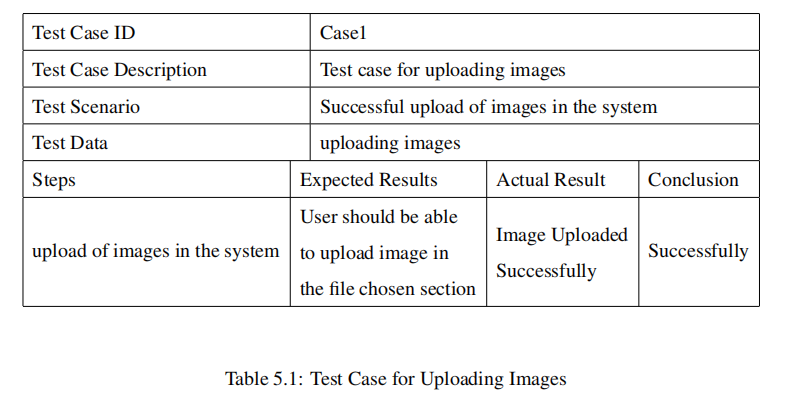

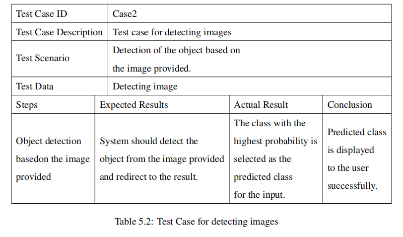

# 4.2.2 System Testing

System testing involves evaluating the performance of the web application in terms of uploading, storing, and displaying images.
Home Page for choosing file

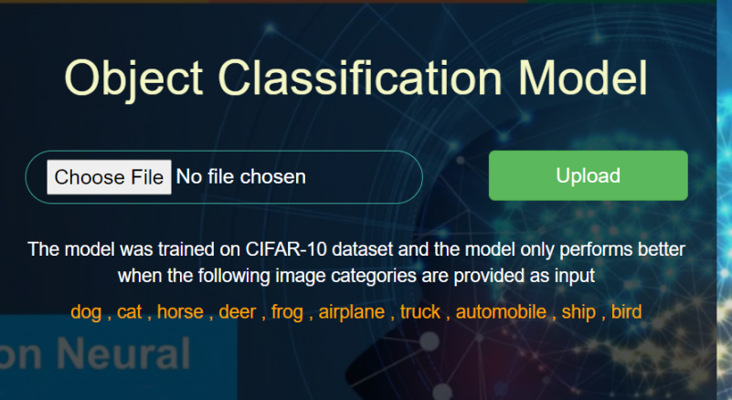

# Choosing File
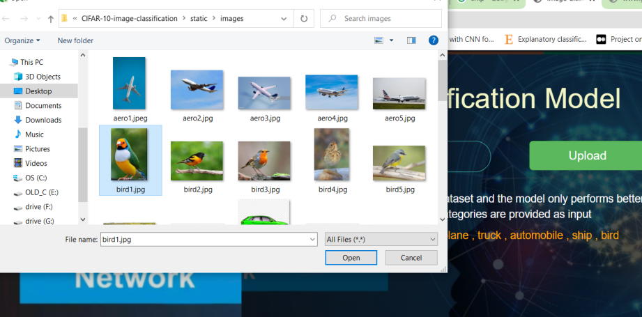
# Files choosen
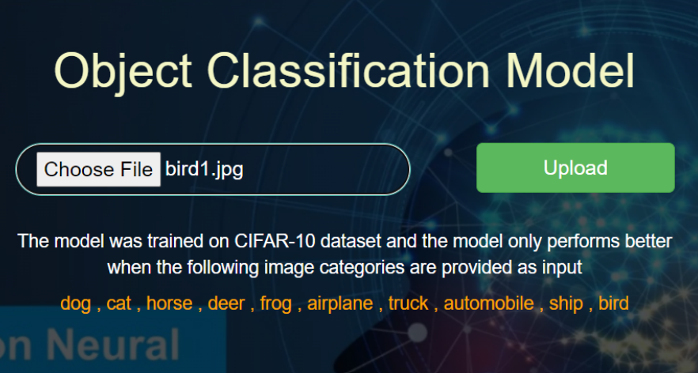
# Prediction

# 4.3 Limitations:
The project "Object Classification Using Lightweight CNN" has a limitation where if images
of objects other than those present in CIFAR10 are inputted, the classification algorithm may
output names that are similar to those in the CIFAR10 dataset but with lower probability.Here
we uploaded normal images of a house, a laptop, and a tiger, respectively. However, these
objects are beyond the scope of our predefined categories, so our model was unable to predict
their true identity. Instead, the model classified them as objects that look similar to those
belonging to the CIFAR10 dataset, resulting in incorrect predictions as shown in figures
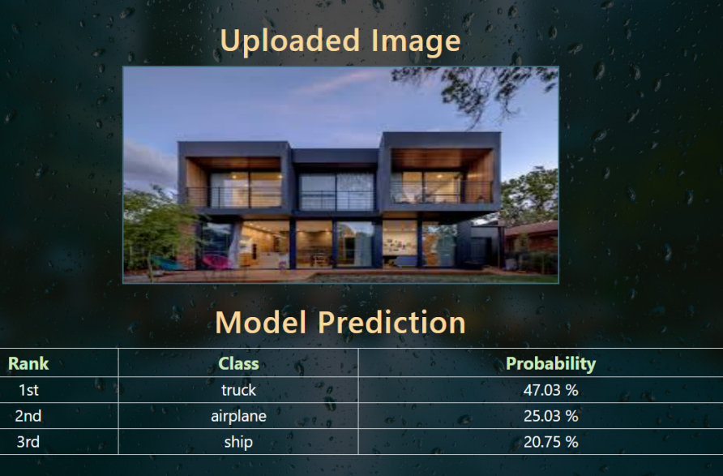

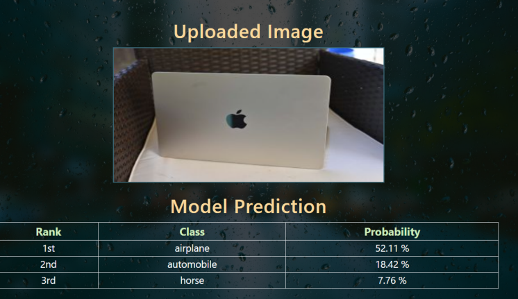

# 4.4 Result Analysis

We checkout performance analysis for various of Kernel.
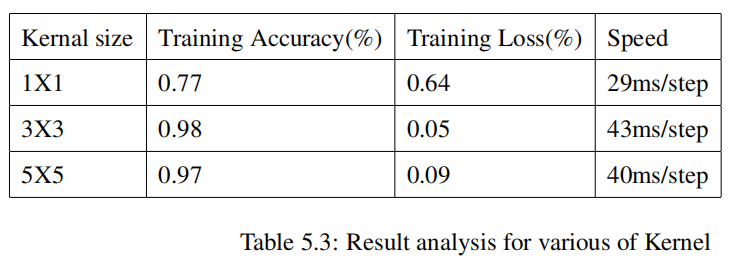
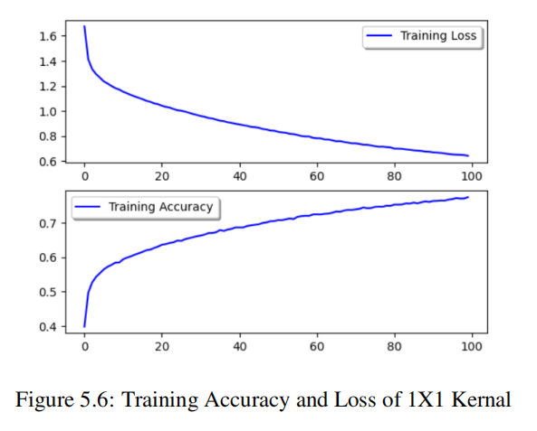
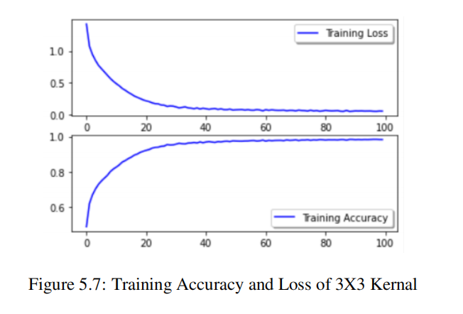
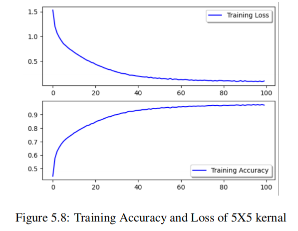
We trained our model using kernel sizes of 1x1, 3x3, and 5x5, and found that the model
achieved the highest accuracy with 98 percentage at 3x3 kernel size. Therefore, we selected
this model as our final one.

# Chapter 5 Future Recommendation and Conclusion
# 5.1 Future Recommendations
Here are some future recommendations for the project "Object Classification Using Lightweight
CNN ":
1. Use Data Augmentation: One way to improve the model’s accuracy is to use data augmentation techniques such as rotation, flipping, and zooming of images. This technique
can help the model learn more robust features and reduce overfitting.
2. Test on Larger Datasets: While the Cifar10 dataset is useful for testing lightweight
models, it would be interesting to test the model on larger datasets such as Cifar100,
ImageNet, or COCO. This would provide a better understanding of the model’s ability
to generalize to different datasets and identify objects in more complex scenes.
# 5.2 Conclusion
The project "Object Classification Using Lightweight CNN " aimed to develop a deep learning model for classifying objects in images using the Cifar10 dataset. The project used a
lightweight convolutional neural network (CNN) architecture and trained it on the Cifar10
dataset, which contains 60,000 32x32 color images in 10 classes.
After training and evaluating the model, the results showed that the architecture achieved an
accuracy of 98 percent on the test set, which is a reasonably good result considering the simplicity of the network. The project also analyzed the training and validation accuracy and loss
curves and concluded that the model did not suffer from overfitting.
Overall, the project successfully demonstrated the effectiveness of using lightweight CNN
architectures for object classification tasks, particularly in situations where computational resources are limited. The project could be extended by testing the model on other datasets or by exploring other lightweight CNN architectures to improve accuracy further.

# 5.3 Snapshots(Obect Detection)
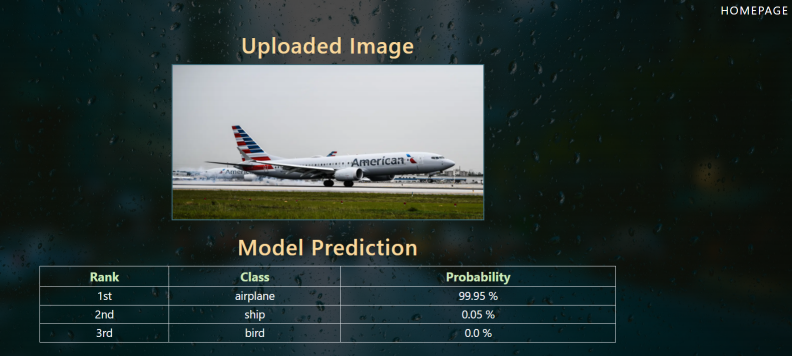
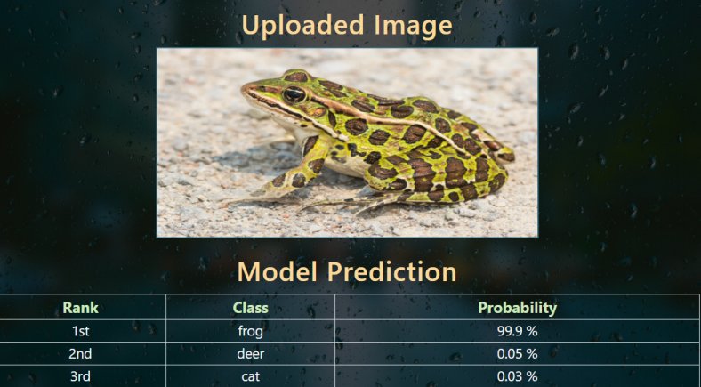
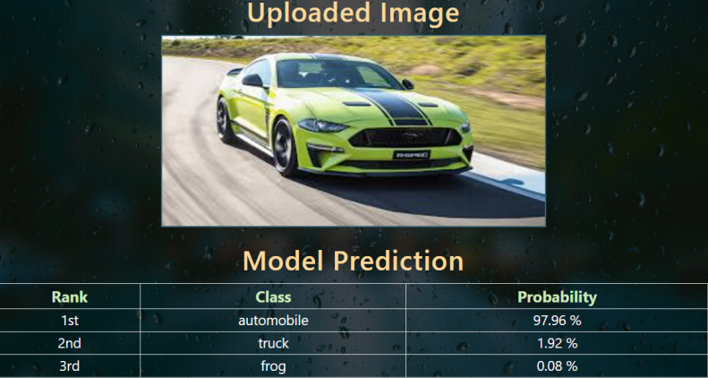

